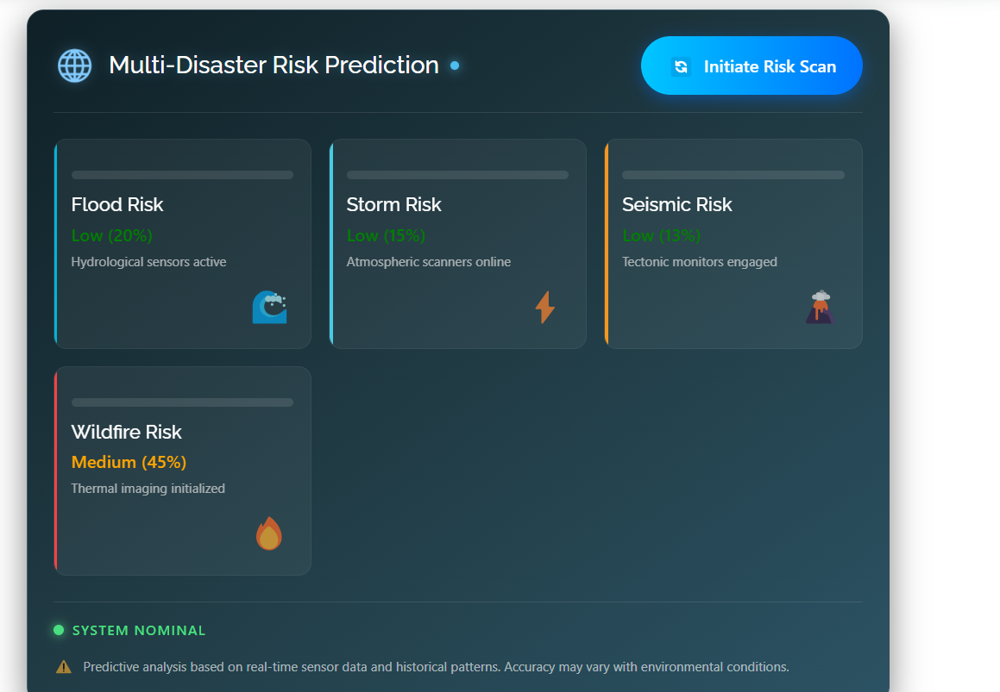

# Res-Q Disaster Relief Platform

Res-Q is an AI-powered disaster response and relief platform designed to streamline crisis management.
It enables users to report disasters, request resources, connect with donors, and access AI-based risk predictions and a first-aid chatbot.
By centralizing reporting, resource allocation, and risk analysis, Res-Q improves coordination and response efficiency during emergencies.

---

## Features

* Disaster event reporting
* Donor, Recipient, and Admin registration
* Resource request and pledging system
* AI-powered first-aid chatbot using Groq API
* Real-time disaster risk prediction (Flood, Earthquake, Storm, Wildfire)
* User location–based risk analysis
* Web-based dashboard with real-time updates

---

## Technology Stack

* Backend: Python Flask, Node.js
* Frontend: HTML, CSS, Bootstrap, JavaScript
* Database: MySQL (XAMPP)
* APIs Integrated:

  * Groq API (Chatbot)
  * OpenWeatherMap API
  * USGS Earthquake API
  * NASA FIRMS Fire Data API

---

## Machine Learning Models (Random Forest)

The platform uses **Random Forest Classifier models** for:

1. Flood Risk Prediction
2. Storm Risk Prediction
3. Weather Risk Prediction
4. Earthquake Risk Prediction
5. Wildfire Risk Prediction

### Data Used for ML Predictions

#### 1. OpenWeatherMap API

Used for Weather, Flood, Storm, and Wildfire predictions.
Data fetched:

* Temperature
* Humidity
* Wind Speed
* Rainfall (precipitation)
* Pressure
* Temperature Difference
* Soil Moisture (approximated where necessary)
* Vegetation-related weather factors
* Drought index estimation (derived)

#### 2. USGS Earthquake API

Used for Earthquake prediction.
Data fetched:

* Magnitude
* Depth
* Event Coordinates
* Distance from user location
* Population density (derived from coordinates)

#### 3. NASA FIRMS API

Used for Wildfire prediction.
Data fetched:

* Active fire locations
* Fire radiative power
* Brightness temperature
* Vegetation index estimation
* Fire confidence score

#### 4. Groq API

Used for chatbot responses and first-aid guidance.

---

## Implementation Summary

* Admin manages disaster events
* Donors register and pledge resources
* Recipients request help
* Flask handles API communication and ML prediction
* Node.js manages real-time updates and dynamic resource tracking
* MySQL manages all data storage

---

## Screenshots

  
  
  
  
  
  
  
  
  
  
  
  

